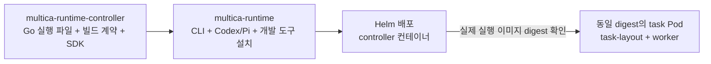
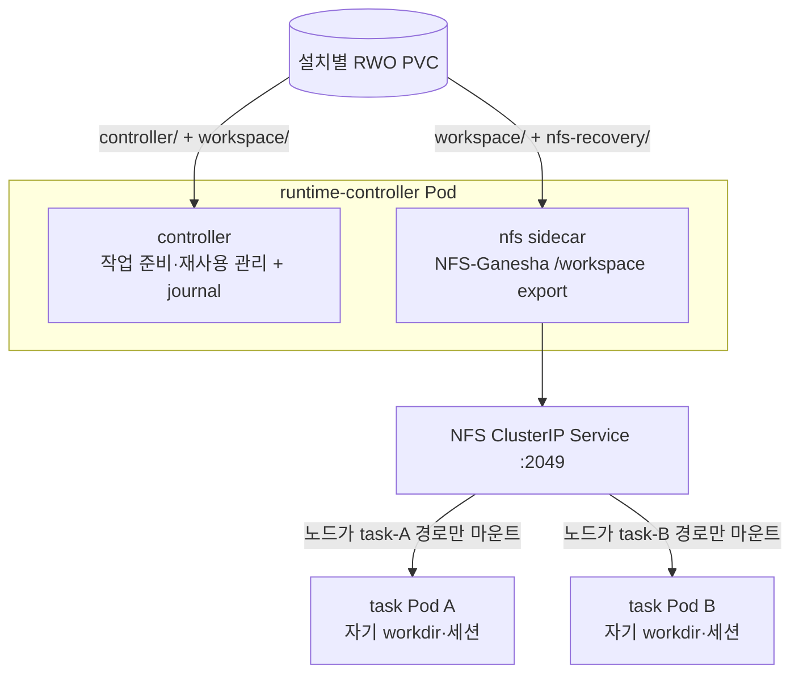
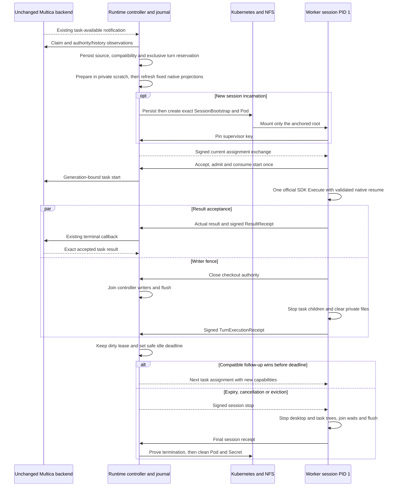

# AGENTS.md

## 코드 구조 개요

`src/cmd`와 `src/internal`은 Kubernetes에서 Multica 작업을 배정하고 실행하는 Go 런타임 컨트롤러 코드입니다. `cmd`는 실행 진입점과 초기화를, `internal`은 작업 제어·실행·저장·외부 연동을 담당합니다.

```text
src/
├── cmd/
│   └── runtime/       # 하나의 runtime 실행 파일과 하위 명령
└── internal/
    ├── checkout/      # 작업별 Git checkout 생성·재사용
    ├── configuration/ # 설정 파일 캡처·검증·HOME 적용
    ├── controller/    # 작업 배정·준비·상태 조정·결과 전달
    ├── core/          # 컨트롤러 빌드 계약과 실행 파일 검증
    ├── daemonapi/     # 백엔드 API 계약·작업 해석·API 게이트웨이
    ├── diagnostics/   # 오류 사유 코드와 단계별 로그
    ├── githubapp/     # 컨트롤러의 GitHub App 토큰 관리
    ├── githubauth/    # Git·gh의 작업별 인증 연결
    ├── initprocess/  # Fixed Linux init roles, signals, primary exit status, and orphan reaping
    ├── kubernetes/    # Pod·Secret 관리와 이미지·스토리지 검증
    ├── processgroup/  # 프로세스 그룹 종료·남은 writer 확인
    ├── repocache/     # 컨트롤러 전용 영속 Git 캐시·갱신·기준 checkout 재사용
    ├── runtimeimage/  # 설치된 런타임 이미지와 실행 환경 검증
    ├── wire/          # 컨트롤러·워커 통신 데이터 형식
    ├── worker/        # 작업 Pod 안의 provider 실행·감독
    └── workspace/     # 작업 파일·세션·영속 상태·결과 기록
```

### `src/cmd/runtime`

`package main`으로 구성된 실행 진입점입니다. 같은 `runtime` 실행 파일이 명령에 따라 컨트롤러, 워커, 초기화 도구, GitHub 인증 도구로 동작합니다.

| 파일 | 역할 |
| --- | --- |
| `main.go` | Dispatches fixed init roles before application signal handling, then routes the existing runtime commands. |
| `controller_options.go` | 환경변수에서 설치 소유자, Pod 식별자, 백엔드·게이트웨이 주소, 용량, 주기와 시간 제한을 읽고 검증합니다. |
| `controller.go` | 이미지·설정·스토리지를 검증하고 Kubernetes 클라이언트, 백엔드 클라이언트, 상태 저장소, GitHub App 관리자를 연결합니다. HTTP 서버와 `controller.Controller.Run`을 시작합니다. |
| `home.go` | 초기화 단계에서 private/storage 볼륨 디렉터리를 준비하고 설정 번들과 이미지 검증 기록을 발행합니다. |

### `src/internal` 패키지별 역할

아래 대표 파일 경로는 각 패키지 폴더 기준입니다. `*_test.go`는 해당 패키지 옆에 있는 테스트 코드입니다.

| 폴더 | 역할과 책임 범위 | 대표 파일 |
| --- | --- | --- |
| `src/internal/checkout` | 컨트롤러가 깨끗한 기준 checkout을 task 안에 독립 복사하고 기존 checkout을 검증·재사용합니다. 기존 수정 사항을 보존하며 NFS에서는 배타적 복사와 완료 표식으로 미완료 checkout의 재사용을 막습니다. | `prepare.go`, `copy.go`, `publish.go` |
| `src/internal/configuration` | 운영자가 제공한 설정 파일을 번들로 캡처·검증하고 컨트롤러·워커 HOME에 적용합니다. 설정과 실행 환경의 digest를 계산하고 파일을 안전하게 게시합니다. | `capture.go`, `bundle.go`, `home.go` |
| `src/internal/controller` | 런타임 등록·heartbeat·작업 claim·용량 제어를 수행합니다. 작업 준비와 Pod 배정을 조율하고, 워커 제어 API·이벤트 수신·취소·결과 전달·장애 복구 및 리소스 정리를 연결합니다. | `controller.go`, `turn_inputs.go`, `continuity_selection.go`, `session_provision.go`, `session_gateway.go`, `session_reconcile.go`, `turn_delivery.go` |
| `src/internal/core` | 베이스 이미지에 포함된 컨트롤러의 `build.json` 계약을 정의합니다. 플랫폼·Go 버전 형식·실행 파일 경로·SHA-256을 검사하고 공통 해시 함수를 제공합니다. | `core.go` |
| `src/internal/daemonapi` | 지원하는 공식 daemon HTTP API에 맞춰 등록·claim·lease·시작·보고·종료 요청을 보냅니다. 백엔드 작업을 provider 실행 입력으로 해석하고, 실행 인증을 확인한 CLI 업무 API를 원본 task 토큰으로 기본 중계합니다. 권한·본문 검증은 백엔드가 담당하며 workspace 수정과 하위 업무 API도 중계합니다. workspace 생성·삭제, 사용자 자격증명·계정 인증/연결, daemon 및 머신 제어, 실행 profile 변경, workspace 결합 검증이 없는 기존 onboarding bootstrap은 앞단 정책으로 차단합니다. 차단 응답은 `runtime_controller_endpoint_blocked` 코드와 컨트롤러 차단 사유를 반환합니다. 원격 MCP·플러그인 자격증명 중계는 별도 실행 권한을 유지합니다. | `client.go`, `claim.go`, `history.go`, `observation.go`, `authority.go`, `compatibility.go`, `provider_defaults.go`, `execution.go`, `gateway.go`, `policy.go` |
| `src/internal/diagnostics` | 오류에 고정된 사유 코드를 붙이고 작업 단계의 시작·종료·소요 시간을 기록하는 공통 진단 도구입니다. | `error.go`, `phase.go` |
| `src/internal/githubapp` | 컨트롤러에서 GitHub App 자격 증명을 사용해 저장소 범위의 installation token을 발급·캐시·갱신하고 접근 권한을 확인합니다. 저장소 URL 해석도 담당합니다. | `manager.go`, `exchange.go`, `repository.go`, `environment.go` |
| `src/internal/githubauth` | Git credential helper와 `gh` 실행을 작업별 인증에 연결합니다. 컨트롤러의 토큰 교환 API를 호출하고 Git·gh 환경을 구성하며 GitHub App 자격 증명이 작업 환경에 전달되지 않도록 필터링합니다. | `client.go`, `credential.go`, `environment.go`, `gh.go` |
| `src/internal/initprocess` | Implements fixed controller, worker-run, and resident worker-desktop roles in the same binary. One Linux wait loop preserves primary status, forwards signals, and reaps adopted children. It owns no result or storage authority. | `init.go`, `init_linux.go`, `init_other.go` |
| `src/internal/kubernetes` | Kubernetes 클라이언트와 worker 정책을 바탕으로 작업 Pod·Secret을 생성·관찰·정리합니다. 컨트롤러 소유권, 실제 이미지, Pod/PVC UID, 마운트·스토리지와 writer 종료 여부를 검증합니다. | `client.go`, `config.go`, `objects.go`, `admission.go`, `watch.go`, `image.go`, `storage.go`, `preparation.go` |
| `src/internal/processgroup` | 명령의 프로세스 그룹을 종료하고 파일을 쓸 수 있는 프로세스가 남아 있는지 확인합니다. Linux에서는 `/proc`의 프로세스·스레드 상태를 검사하며 다른 플랫폼용 구현을 분리합니다. | `group.go`, `group_linux.go`, `group_other.go` |
| `src/internal/repocache` | 컨트롤러의 비공개 PVC에 workspace·저장소·인증 주체별 bare 객체를 보관합니다. 안전한 HTTPS 다운로드, 증분 갱신, 현재 refs의 깨끗한 기준 checkout 재사용, 동시성·실제 공간 부족 처리·정리·복구를 담당합니다. | `manager.go`, `snapshot.go`, `remote.go`, `storage.go` |
| `src/internal/runtimeimage` | 이미지 descriptor와 controller·daemon·provider 실행 파일, 마운트·환경을 검증합니다. 이미지 digest·설정 digest가 연결된 실행 참조와 초기화 검증 기록을 제공하고 실행 환경변수를 구성합니다. | `types.go`, `verify.go`, `mounts.go`, `env.go`, `receipt.go` |
| `src/internal/wire` | 컨트롤러와 워커가 공유하는 `Bootstrap`, `Run`, provider 이벤트·결과, checkout 요청·승인, 종료 명령을 정의합니다. 공통 경로·크기 제한·식별자 검증과 이벤트의 민감 정보 제거도 포함합니다. | `session.go`, `bootstrap.go`, `run.go`, `event.go`, `wire.go` |
| `src/internal/worker` | 작업 Pod의 HOME·설정·임시 디렉터리를 준비하고 Linux PID 1 supervisor에서 provider를 실행합니다. 로컬 API/checkout 릴레이, 이벤트·결과 보고, 취소·watchdog, 자식 종료와 서명된 종료 확인 전송을 담당합니다. | `session_linux.go`, `session_control.go`, `layout.go`, `supervisor_linux.go`, `home.go`, `execution.go`, `relay.go` |
| `src/internal/workspace` | 작업별 디렉터리·provider 설정·세션을 준비하고 재사용 가능 여부를 검증합니다. 파일 기반 journal에 작업 실행 권한과 상태 전이, capability 토큰, 이벤트·결과 전달 상태, 종료 확인과 스토리지 사용권을 영속화합니다. | `conversation.go`, `session_reservation.go`, `session_control.go`, `session_lifecycle.go`, `session_validate.go`, `prepare.go`, `store.go`, `grant.go`, `outbox.go` |

## 이미지·NFS·task 실행 흐름

A worker Pod runs `worker serve` for one journaled WorkerSession. Every request type uses the same idle retention policy. Compatible tasks in the same proved context can use that Pod sequentially.

### 1. 컨트롤러 베이스 이미지 위에 provider 설치

1. 이 프로젝트의 [Dockerfile](Dockerfile)은 Go 컨트롤러를 빌드해 `/opt/multica/controller/runtime`과 `build.json`, Go SDK를 포함한 베이스 이미지를 만듭니다.
2. 최종 `multica-runtime` 이미지는 이 베이스 위에 언어·개발 도구·데스크톱 환경·Multica CLI와 Codex/Pi provider를 **이미지 빌드 시점에 설치**합니다.
3. 이미지 빌드의 마무리 단계에서 컨트롤러 빌드 계약과 daemon/provider의 경로·버전·실행 파일 해시, 기본 환경을 `/opt/multica/runtime/image.json`에 기록합니다. 완성된 이미지에는 작업 실행에 필요한 provider가 이미 들어 있습니다.
4. Helm은 이 최종 runtime 이미지로 컨트롤러를 배포합니다. [BindImage](src/internal/kubernetes/image.go)는 현재 컨트롤러 Pod에서 실제 실행 중인 이미지 digest를 확인하고, [podObject](src/internal/kubernetes/objects.go)는 그 digest를 task Pod의 초기화·worker 이미지에도 사용합니다.
5. The runtime entrypoint prepares role-specific environment settings. It executes `runtime init controller` for the controller and directly executes `worker serve` as PID 1. The admitted worker starts desktop services through the existing entrypoint helper.



### 2. 컨트롤러 Pod가 제공하는 NFS와 작업 데이터 재사용

Helm은 `replicas: 1`, `Recreate`인 컨트롤러 Deployment에 **controller와 nfs 컨테이너를 함께 배치**합니다. 설치별 RWO PVC 하나를 아래처럼 나누어 마운트하고, NFS-Ganesha sidecar가 그중 `/workspace`를 공유합니다. task Pod의 NFS 접속 주소는 컨트롤러 Pod를 선택하는 ClusterIP Service의 TCP 2049입니다.

| PVC 내부 디렉터리 | 컨트롤러 Pod 안의 마운트 | 용도 |
| --- | --- | --- |
| `controller/` | controller의 `/var/lib/multica/controller` | task/attempt 권한, 상태, 이벤트·결과 전달을 기록하는 비공개 journal |
| `workspace/` | controller와 nfs의 `/workspace` | 작업 디렉터리 준비, 작업 파일 보존, NFS 공유 |
| `nfs-recovery/` | nfs의 `/var/lib/nfs/ganesha` | NFS 서버 재시작 시 사용하는 복구 상태 |

실제 [TaskRoot](src/internal/workspace/paths.go)는 `/workspace/<workspace 폴더>/<task 폴더>`입니다. 신규 경로는 공식 CLI 규칙에 따라 workspace slug와 이슈 식별자를 사용합니다. 예를 들어 `kor-io-<workspace UUID 마지막 12자리>/kor-219-<task UUID 마지막 12자리>`이며, 값이 없으면 각각 `workspace`, `task`를 접두사로 사용합니다. 접두사는 안전한 소문자 ASCII로 정규화하고 각 폴더 이름을 24자로 제한합니다. workspace/task ID 쌍별로 처음 결정한 경로를 journal과 native index에 고정하며, 기존 task는 slug나 이슈 식별자가 바뀌어도 저장된 경로를 유지합니다. workspace 이름 변경 후 신규 task만 새 부모 폴더를 사용할 수 있습니다. journal은 전체 UUID로 소유권과 경로 충돌을 검사합니다. task Pod는 전체 `/workspace`나 PVC를 직접 받지 않고, `NFSVolumeSource.Path = TaskRoot`인 볼륨을 **자신의 TaskRoot에만 마운트**합니다. 작업 디렉터리는 그 아래 `workdir/`이며 provider별로 `codex-home/`, `pi-sessions/` 등의 상태도 보존합니다.



The private journal separates the conversation tuple, anchored workspace generation, WorkerSession, and real task attempt. The tuple uses full installation/workspace/subject/agent identities. Backend observations prove accepted native producers. Final storage proof is independent. [ReserveTurn](src/internal/workspace/session_reservation.go) retains one exact writer lease and allocates a turn before preparation. Protocol-2 [PrepareTask](src/internal/workspace/prepare.go) invokes the unchanged helper in private scratch. Immutable skill generations and bounded private metadata refresh fixed native projections without helper writes into a live workdir.

`WorkspaceAnchorTaskID` is the first real task in the generation. It keeps the native root, `.task_owner`, and `.task_roots` index stable across compatible tasks. Actual task IDs remain in context, credentials, API calls, events, and results. Compatible issue/native-DM follow-ups retain the same Pod and checkout edits. Core authority, repository scope, image and configuration bind workspace reuse. Native history additionally requires exact producer evidence and resolved compatible provider settings. Missing native hints, unknown defaults or opaque integrations permit fresh SDK history in the same safe workspace. Unknown core authority never grants previous files. Group/channel, autopilot, and quick-create execution stays task-scoped because no broader reset-safe context is proved.

All request types and providers use `runtime.conversationIdleTimeout`, which defaults to ten minutes after accepted delivery and signed task settlement. Healthy desktop services, browser windows, and opened applications stay active during idle. Storage remains dirty and exclusively leased to that WorkerSession. New Pods use `worker-`; identity namespaces do not change retention policy. An accepted ordinary failure may retain its workspace without publishing native history. Zero closes each Pod after its task. `runtime.maxResidentPods=0` resolves to execution capacity. Idle Pods release execution capacity while retaining resident capacity and the writer lease. Expiry or eviction must prove actual termination before replacement. BuildKit and private tool caches remain separate.

task 마운트와 스토리지 검증 코드는 [objects.go](src/internal/kubernetes/objects.go), [storage.go](src/internal/kubernetes/storage.go)에 있습니다.

### 3. 백엔드 task 수신부터 이슈 처리·완료까지

**작업 수신은 백엔드의 기존 WebSocket 알림으로 HTTP claim을 깨우는 방식**입니다. 최초 연결·재연결·용량 반환에도 claim을 실행하며, 주기적인 폴링은 알림 누락을 복구합니다. `Controller.Run`이 `POST /api/daemon/tasks/claim`의 응답으로 task를 받습니다. 워커가 `/internal/attempts/<attemptID>/event`로 보내는 이벤트는 실행 중 메시지·사용량 보고입니다.

1. **시작·등록**: `home layout`이 설정 번들과 이미지 검증 기록을 준비합니다. `cmd/runtime/controller.go`가 실제 이미지·PVC·NFS를 확인하고 journal을 연 뒤, `controller.register`가 사용 가능한 provider를 백엔드 workspace별 runtime으로 등록합니다.
2. **Claim and selection:** Persist the unchanged claim with `QueueClaim`. The controller observes current authority and exact accepted source tasks through existing backend APIs. It freezes backend source selection, waits for prior writers, resolves native defaults with a restricted metadata-only probe, and records typed compatibility. `ReserveTurn` allocates one session turn or waits for proven shutdown.
3. **Preparation:** Acquire current skills/MCP inputs and recheck reusable authority. Run the official helper in private scratch. Publish immutable artifacts and refresh fixed native projections in the anchored root. Persist current preparation and Run input; never reuse the previous task's prompt or credentials.
4. **Pod and assignment:** A new WorkerSession owns one immutable SessionBootstrap Secret and exact Pod create request. The bootstrap contains no task bearer, prompt, or business capability. Existing warm sessions keep their Pod UID. After session-key admission, publish and offer a signed per-turn assignment with rotated capabilities and deadlines.
5. **Start:** PID 1 accepts only the current assignment, verifies installed image and native paths, refreshes task-owned HOME configuration, and starts the unchanged official SDK through a private runner. Resident Chrome retains its existing image HOME profile. The existing generation-bound backend start request is consumed once. The supervisor key and runner result socket are not inherited by provider children.
6. **Execution:** The loopback relay forwards current-task API requests through Pod/session/turn admission to the backend. Backend authorization remains authoritative. On-demand checkout uses the current task's repositories and the anchored workdir. Existing checkout edits are retained. Events and usage remain attributed to the actual task.
7. **Completion:** Persist the actual SDK result and validate its signed ResultReceipt. Close task routes and controller writers, stop nonresident processes, and reset private task state. A fresh signed TurnExecutionReceipt certifies those outcomes. Exact accepted backend completion and settled events can enter Idle with dirty storage and a retained lease. Final shutdown stops both trees, joins both command waits, and coordinates filesystem flush. Final receipt, actual termination, and accepted latest-producer evidence permit a clean checkpoint. Failed cleanup cannot overwrite an authenticated result.

Journal schema 16 validates and migrates schemas 6–15. Historical Pod requests, UIDs, bootstrap bytes, signatures, and writer leases remain intact. Nonclosed protocol-1 sessions durably drain before service resumes. Their issued result/event/stop traffic can finish; no new old-protocol assignment is issued. Legacy records retain uncertain delivery, quarantine, and resource recovery obligations. They gain no inferred resident authority. A completed attempt has `TurnComplete`; only its WorkerSession owns resource cleanup. The store publishes memory only after validation and durable filesystem publication. Missing Pods and expired leases are not termination evidence.



흐름의 중심 코드는 [controller.go](src/internal/controller/controller.go), [dispatch.go](src/internal/controller/dispatch.go), [prepare.go](src/internal/controller/prepare.go), [gateway.go](src/internal/controller/gateway.go), [worker supervisor](src/internal/worker/supervisor_linux.go), [reconcile.go](src/internal/controller/reconcile.go)입니다. 위 순서도는 정상 처리 경로를 나타냅니다.

The worker signs only an observed SDK result. Turn execution and final storage receipts have distinct authority. Sibling fixed desktop and SDK init roles own their adopted descendants. PID 1 waits for both managed command barriers before generic namespace reaping. Turn cleanup follows live kernel ancestry and reaps only exact unmanaged child PIDs. The signing key and final writer/flush fence remain PID 1 responsibilities. Desktop-root or display-generation loss drains instead of recreating a desktop. Task deadlines and cancellation still reach final cleanup.

### task 디렉터리 격리와 보안 경계

- **파일 범위**: 각 task Pod에는 해당 TaskRoot만 보이며 다른 task 디렉터리와 컨트롤러 journal은 마운트되지 않습니다. 준비·재사용 시 경로와 링크를 검증하고 같은 task 경로를 사용하는 실행이 겹치지 않도록 제어합니다.
- **실행·API 권한**: worker는 비루트 UID/GID 65532, Linux capability 전체 제거, privilege escalation 금지, ServiceAccount 토큰 자동 마운트 비활성화 상태로 실행됩니다. 컨트롤러 게이트웨이는 task/attempt capability와 실제 Pod·PVC·이미지 식별자를 함께 확인합니다.
- **NFS 접근 경로**: 배포 시 적용하는 NetworkPolicy는 NFS TCP 2049를 `nfs.trustedNodeCIDRs`의 노드 주소에 허용하고 worker의 일반 소켓에는 해당 egress를 열지 않습니다. 노드가 NFS를 마운트해 제공하고 worker 프로세스는 그 마운트된 파일 경로를 사용합니다.

이 구성은 task별 디렉터리를 분리하는 샌드박스 형태의 파일 접근 제한을 제공합니다. NFS 서버 자체는 `/workspace` 전체를 `AUTH_SYS`로 export하므로, 격리는 **task별 마운트·권한 제한·올바른 trusted node CIDR·CNI의 NetworkPolicy 적용**을 함께 전제로 합니다. 또한 worker의 root filesystem은 쓰기 가능하고 컨테이너 seccomp는 `Unconfined`이므로, 디렉터리 분리만으로 모든 보안 문제가 해결되는 독립 보안 샌드박스로 설명하지 않습니다.

### 코드를 읽을 때 구분할 경계

- `core`는 컨트롤러 빌드 자체를, `runtimeimage`는 그 위에 설치된 daemon·provider·도구와 실제 실행 구성을 다룹니다.
- `controller`는 실행 순서를 조율하고, `workspace`는 영속 상태·작업 디렉터리를 관리하며, `kubernetes`는 클러스터에서 관찰한 리소스의 상태를 검증합니다.
- `daemonapi`는 백엔드 HTTP 계약을, `wire`는 이 저장소의 컨트롤러·워커 간 데이터 계약을 정의합니다.
- `githubapp`은 컨트롤러의 App 자격 증명과 installation token 관리를, `githubauth`는 작업에서 사용하는 Git·gh 인증 연결을 담당합니다.
- 저장소 checkout은 작업 중 필요할 때 수행됩니다. 작업 환경 준비와 실제 Git checkout은 별도 단계입니다.
- `repocache`의 `/var/lib/multica/controller/repositories`는 NFS export 밖의 공유 다운로드 캐시입니다. 캐시 키에 task ID를 넣지 않으며, conversation workspace reuse와 구분합니다. worker는 캐시를 마운트하지 않으며 컨트롤러가 task에 복사한 독립 Git 객체를 NFS로 읽습니다. 캐시 전용 Helm 설정과 고정 byte 상한은 없습니다. 컨트롤러는 task 작성자를 journal에 기록하고, worker는 checkout 종료 fence·작성자 종료·컨트롤러 로컬 flush 확인을 받은 뒤 NFS client를 flush·서명합니다. Git 원격은 공개 HTTPS만 허용합니다.
