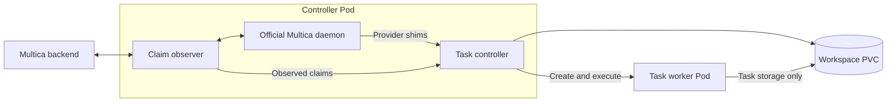

# Multica Runtime Controller

Run Multica agent tasks in isolated Kubernetes Pods with persistent workspaces and a shared, verified runtime image.

This repository provides the **controller base image** at `ghcr.io/korioinc/multica-runtime-controller`. It contains the controller executable, provider shims and Go SDK. Build a complete image with the official Multica CLI, agent providers and development tools using [Multica Runtime](https://github.com/korioinc/multica-runtime), then deploy it with the [Helm chart](https://github.com/korioinc/helm/tree/main/charts/multica-runtime-controller).

## Architecture

The official Multica daemon handles scheduling, prompts, checkout policy and completion reporting. The controller observes successful claims, authorizes provider requests and manages each task's worker Pod.



1. At startup, the controller validates the installed runtime descriptor, executable contents and initialized configuration. It binds the running Pod and platform to the image digest reported by Kubernetes.
2. The daemon claims a task and invokes a provider shim. The controller checks the observed claim, credentials, repository scope and managed workspace paths.
3. The controller prepares task context and a private HOME archive, records the attempt, and creates its request Secret and worker Pod.
4. Worker init verifies and publishes the prepared HOME. The worker starts the installed provider in the task workdir, preserving its input, output and exit status.
5. The controller reconciles task resources and interrupted attempts using durable records and Kubernetes resource identities.

Controller and worker Pods use the same complete image. Workers keep the controller's admitted image digest even if a registry tag changes. A new image or configuration takes effect through a replacement controller Pod.

## Deployment

Use the [Helm chart](https://github.com/korioinc/helm/tree/main/charts/multica-runtime-controller) with a complete runtime image, a Multica controller token Secret and persistent workspace storage. The controller base requires the CLI and providers supplied by the complete image before it can run tasks.

Example chart values:

```yaml
image: ghcr.io/korioinc/multica-runtime:latest
imagePullPolicy: Always
platform: linux/amd64
multica:
  baseURL: https://multica.example.com
  controllerTokenSecret:
    name: multica-runtime-controller-token
    key: token
workspace:
  storage:
    existingClaim: multica-workspace
    accessMode: ReadWriteMany
```

Set the backend URL, Secret and PVC names for your installation. Both `linux/amd64` and `linux/arm64` are supported; select the platform available on your nodes. `ReadWriteOnce` storage requires `scheduling.singleNodeName` so the controller and workers use the same node. `ReadWriteMany` allows suitable storage to serve multiple nodes.

The chart configures controller capacity, polling, worker resources, task deadlines, scheduling and network policies. Refer to its [values](https://github.com/korioinc/helm/blob/main/charts/multica-runtime-controller/values.yaml) for the complete configuration.

## Images

| Component | Responsibility |
| --- | --- |
| [Controller base](https://github.com/korioinc/multica-runtime-controller) | Controller, provider shims, Go SDK and runtime verification |
| [Complete runtime](https://github.com/korioinc/multica-runtime) | Official Multica CLI, providers, development tools, image defaults and installation |
| [Helm chart](https://github.com/korioinc/helm/tree/main/charts/multica-runtime-controller) | Kubernetes deployment, storage, configuration and scheduling |

The base installs its executable and build metadata under `/opt/multica/controller`, with the Go SDK at `/usr/local/go`. A complete image supplies `/opt/multica/runtime/image.json`, which identifies the controller build, installed tool paths and hashes, supported platform and image defaults. Admission validates these installed contents directly.

Run these checks inside the relevant image:

```sh
/opt/multica/controller/runtime version
/opt/multica/controller/runtime image verify
```

The first checks the controller base. The second validates the complete image descriptor and installed files. Runtime tools are installed during the image build; adapter integration scenarios run separately in this repository's local verification harness.

## Storage and configuration

The workspace PVC stores task work, selected native sessions and controller recovery records. Each worker mounts only its task storage and selected session file. The controller registry and Kubernetes service account token are excluded from worker mounts.

Workers run as the `multica` user with UID/GID `65532`, a read-only root filesystem and private writable HOME, temporary and control directories. Providers and interactive worker shells start in `/workspace/<workspace>/<task>/workdir`; HOME is `/home/multica/agents`.

Each worker mounts a separate memory-backed `emptyDir` at `/dev/shm`, with a `256Mi` size limit. This is a capacity limit, not a memory reservation; actual usage counts toward the worker's memory limit. HOME, `/tmp` and control directories remain on the ordinary `runtime-private` emptyDir. Browsers launched with `--disable-dev-shm-usage` use temporary storage instead of this mount, so the `256Mi` limit does not cap their total shared-memory or RAM usage. Account for worker memory, temporary storage and concurrent task load when sizing the deployment.

Supply provider configuration files through the chart's `operator.configVolumes` and `operator.configMounts`, and environment values through `operator.env` and `operator.envFrom`. Controller tokens and task requests use dedicated Secrets.

Controller init captures selected ConfigMap files into a committed configuration bundle. For each attempt, the controller combines that bundle with image defaults and task-specific provider inputs to prepare a complete HOME archive. Worker init validates the archive's contents and identity before publishing HOME. Operator files take precedence over image defaults.

Configuration edits, authentication refreshes and package changes inside private HOME remain local to that Pod. Matching init retries preserve the prepared HOME. Task work and selected sessions persist on the workspace PVC; session reuse is checked against the task scope and selected runtime inputs. Operator environment values are selected at controller startup and carried to providers in the task request Secret; workers do not reread the original operator Secrets.

## GitHub App authentication

Set `GITHUB_APP_ID` and `GITHUB_APP_PRIVATE_KEY` through the chart's existing `operator.env` or `operator.envFrom` configuration. Both must be present to enable managed authentication. Use a Secret for the private key, and grant the App access to the task repositories. The App must have **Contents: Read** for clone/fetch; push requires its granted **Contents: Read and write** permission. No PAT or `gh auth login` is required for this mode.

```yaml
operator:
  env:
    # Add these entries to the existing operator.env array.
    - name: GITHUB_APP_ID
      value: "123456"
    - name: GITHUB_APP_PRIVATE_KEY
      valueFrom:
        secretKeyRef:
          name: multica-github-app
          key: private-key
```

The controller discovers the repository's App installation and issues a token for the requested repository scope. It caches tokens in memory, using GitHub's `expires_at`, and renews on a request when **five minutes or less remain**. Concurrent requests for the same scope share issuance, and cancellation of one task does not cancel another caller's renewal. A failed required renewal returns an error instead of the old token. App permissions and repository access must be approved on the GitHub installation; repository registration in Multica alone does not grant GitHub access.

The official daemon's HTTPS Git operations use a repository-aware credential helper over a controller-private Unix socket. Task workers use their localhost gateway, the controller's task authentication, and the active attempt's private capability before the same token service can be reached. The requested repository must belong to the observed task scope. App signing keys and webhook secrets are excluded from daemon and worker environments and task request Secrets. The runtime does not persist installation tokens in Git remote URLs, Git configuration, HOME files, or its logs.

Workers receive an authenticated `gh` wrapper on their normal PATH. Each invocation obtains a current token before starting the installed GitHub CLI. Explicit `-R`/`--repo`, GitHub API repository paths, `GH_REPO`, and a checkout's origin select the token scope. Commands without a repository target, including `gh auth status` and GraphQL calls, use the task's GitHub repositories when they share one installation owner. For tasks spanning owners, select the repository explicitly; the wrapper will not choose an unrelated installation. GitHub App tokens support repository operations allowed by the App; user-account-only endpoints and commands are not made available by installation authentication.

Managed tokens preserve only the App's granted repository permissions for contents, metadata, pull requests, issues, actions, checks, statuses, workflows, deployments, and discussions. Organization, administration and secrets permissions are not inherited. Managed authentication supports HTTPS `github.com` Git URLs and GitHub CLI requests to `github.com`/`api.github.com`. The managed CLI rejects other API hosts. SSH Git commands continue to use separately configured SSH authentication.

Git requests refresh through the helper, and a long-lived task's later `gh` invocations refresh independently. A **single `gh` invocation that runs beyond its token's expiry**, such as a long `gh run watch`, does not refresh its already-running process environment. The wrapper never replays a CLI command, since that could repeat writes. Directly invoking the original `gh` executable bypasses the PATH wrapper.

When App authentication is absent, existing Git/GitHub CLI authentication continues to apply. When it is enabled, its GitHub-host helper and worker `gh` wrapper take precedence over static GitHub tokens. After changing App configuration, replace the controller Pod so new tasks receive the selected configuration; finish active tasks first. A complete runtime image must be rebuilt with the updated controller base before rollout.

## Operations

Controller and worker services write operational logs to stdout, including task and attempt identifiers. Inspect them with:

```sh
kubectl -n "$NAMESPACE" logs -f deployment/multica-runtime-controller -c controller
kubectl -n "$NAMESPACE" logs -f "$WORKER_POD" -c worker
```

Set `NAMESPACE` and `WORKER_POD` for your deployment, and adjust the Deployment name if customized. Operational logs omit credentials, prompts and request bodies.

Task execution requires an observed claim and matching resource identities. The controller rechecks its live Pod identity before authorizing execution. Before creating task resources, each provider shim registers its attempt with a monitor in the controller. If the shim is killed, the controller starts recovery when its private connection closes; storage leases and Kubernetes UIDs still guard deletion. Worker termination respects the configured grace period. The periodic collector retries incomplete cleanup and recovers interrupted attempts after controller restarts. Recovery reconciles recorded resources before storage reuse; invalid records stop recovery and require investigation.

## Development

The Go module is in [`src`](src), with the runtime entrypoint in [`src/cmd/runtime`](src/cmd/runtime). The main packages are [`official`](src/internal/official) for daemon integration, [`execution`](src/internal/execution) for task orchestration, [`kubernetes`](src/internal/kubernetes) for worker resources, and [`workspace`](src/internal/workspace) for persistent authority and storage.

```sh
make build
make test
make test-race
make vet
make repository-validate
make workflow-validate
make verify-core
```

The GitHub authorization tests also have an opt-in native layer. Run it only in a disposable Linux container with fresh `/workspace`, `/run/multica`, and `/etc/multica/task` volumes. Mount the built Linux runtime and an installed Linux `gh` binary read-only at the paths below, with a writable executable `/tmp`. The tests use local authorization fixtures and need no GitHub credentials or external network access:

```sh
GITHUB_AUTH_NATIVE_TEST=1 \
GITHUB_AUTH_NATIVE_RUNTIME=/opt/multica/controller/runtime \
GITHUB_AUTH_NATIVE_GH=/opt/github-native/gh \
go -C src test -tags githubintegration ./internal/execution -run NativeGitHub -count=1
```

This exercises the real Git credential protocol and GitHub CLI through the worker gateways, and checks that the official daemon's environment filtering cannot disable the controller's admitted App mode. The native command subtests require both executable paths above.

`make verify` runs the full base verification suite, including shell checks and release-script fixtures. It requires Go, Docker with Buildx, Make, Bash, jq, Git, ripgrep and ShellCheck. The Go toolchain pin is maintained in [`build/runtime-versions.env`](build/runtime-versions.env).

For Kubernetes integration, build a complete runtime from this checkout's base using the runtime repository's build script. Provide that image and a local chart checkout explicitly:

```sh
scripts/verify-local.sh \
  --chart ../helm/charts/multica-runtime-controller \
  --runtime-image multica-runtime:local \
  --keep-on-failure
```

Integration also requires Helm and native ORAS. The harness creates a disposable local registry, backend, Git origin and Kubernetes node to exercise real task Pods, checkout, HOME preparation, session reuse, authorization and recovery. It uses its own cluster context and prints the evidence directory. Local execution verifies the host's native platform.

The develop promotion workflow maintains a PR into main. The separate [develop image workflow](.github/workflows/develop-image.yml) runs on pushes to `develop`, including merges, and can be dispatched manually on that branch. It validates the exact source, builds and verifies both native Linux platforms, and publishes only `ghcr.io/<repository-owner>/multica-runtime-controller:develop`. It does not create per-build tags, GitHub Releases, or update `latest` or [`VERSION`](VERSION).

Develop runs are serialized through publication, with only the newest pending run retained. Publication rechecks the current branch HEAD and the run number recorded on the existing image index, so a superseded branch revision or an older run retried at the same commit cannot replace a newer published build. Platform images are staged by digest without tags; only the verified pair receives the `develop` tag. Failed or superseded builds leave the existing tag in place. Registry manifests without tags may remain; the workflow does not delete manifests that an image index may still reference.

This workflow publishes the controller **base** image. Consuming it in a complete runtime build and rolling out that runtime are separate deployment steps. Existing workers remain bound to their controller's admitted complete-image digest.

To release, explicitly increase VERSION (for example, `1.2.3`) and merge it into `main`. The [tag workflow](.github/workflows/tag-version.yml) creates the matching tag (`1.2.3`, without a `v` prefix) at that exact commit and requests the [release workflow](.github/workflows/release.yml). A main push with an unchanged VERSION does not request a release.

The release workflow accepts version tag pushes or a manual dispatch on an existing tag with its original full commit SHA. The tag must match the committed VERSION and identify a commit in main's history. It validates the source, builds and verifies both native Linux platforms, then publishes the controller base to GHCR and creates a GitHub Release. Retries retain the verified image bytes; completing an older release never moves the GHCR or GitHub latest pointer backwards.
