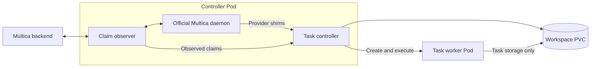

# Multica Runtime Controller

Run Multica agent tasks in isolated Kubernetes Pods with persistent workspaces and a shared, verified runtime image.

This repository provides the **controller base image** at `ghcr.io/korioinc/multica-runtime-controller`. It contains the controller executable, provider shims and Go SDK. Build a complete image with the official Multica CLI, agent providers and development tools using [Multica Runtime](https://github.com/korioinc/multica-runtime), then deploy it with the [Helm chart](https://github.com/korioinc/helm/tree/main/charts/multica-runtime-controller).

## Architecture

The official Multica daemon handles scheduling, prompts, checkout policy and completion reporting. The controller observes successful claims, authorizes provider requests and manages each task's worker Pod.



1. At startup, the controller validates the installed runtime descriptor, verification record and initialized configuration. It binds the running Pod and platform to the image digest reported by Kubernetes.
2. The daemon claims a task and invokes a provider shim. The controller checks the observed claim, credentials, repository scope and managed workspace paths.
3. The controller prepares task context and a private HOME archive, records the attempt, and creates its request Secret and worker Pod.
4. Worker init verifies and publishes the prepared HOME. The worker starts the installed provider in the task workdir, preserving its input, output and exit status.
5. The controller reconciles task resources and interrupted attempts using durable records and Kubernetes resource identities.

Controller and worker Pods use the same complete image. Workers keep the controller's admitted image digest even if a registry tag changes. A new image or configuration takes effect through a replacement controller Pod.

## Deployment

Use the [Helm chart](https://github.com/korioinc/helm/tree/main/charts/multica-runtime-controller) with a complete runtime image, a Multica controller token Secret and persistent workspace storage. The controller base requires the CLI and providers supplied by the complete image before it can run tasks.

Example chart values:

```yaml
image: ghcr.io/korioinc/multica-runtime:latest
imagePullPolicy: Always
platform: linux/amd64
multica:
  baseURL: https://multica.example.com
  controllerTokenSecret:
    name: multica-runtime-controller-token
    key: token
workspace:
  storage:
    existingClaim: multica-workspace
    accessMode: ReadWriteMany
```

Set the backend URL, Secret and PVC names for your installation. Both `linux/amd64` and `linux/arm64` are supported; select the platform available on your nodes. `ReadWriteOnce` storage requires `scheduling.singleNodeName` so the controller and workers use the same node. `ReadWriteMany` allows suitable storage to serve multiple nodes.

The chart configures controller capacity, polling, worker resources, task deadlines, scheduling and network policies. Refer to its [values](https://github.com/korioinc/helm/blob/main/charts/multica-runtime-controller/values.yaml) for the complete configuration.

## Images

| Component | Responsibility |
| --- | --- |
| [Controller base](https://github.com/korioinc/multica-runtime-controller) | Controller, provider shims, Go SDK and runtime verification |
| [Complete runtime](https://github.com/korioinc/multica-runtime) | Official Multica CLI, providers, development tools, image defaults and installation |
| [Helm chart](https://github.com/korioinc/helm/tree/main/charts/multica-runtime-controller) | Kubernetes deployment, storage, configuration and scheduling |

The base installs its executable and build metadata under `/opt/multica/controller`, with the Go SDK at `/usr/local/go`. A complete image supplies `/opt/multica/runtime/image.json` and `/opt/multica/runtime/verification.json`, binding its installed tools to successful adapter verification.

Run these checks inside the relevant image:

```sh
/opt/multica/controller/runtime version
/opt/multica/controller/runtime image verify
```

The first checks the controller base. The second validates the complete image, installed files and verification record. Runtime tools are installed during the image build.

## Storage and configuration

The workspace PVC stores task work, selected native sessions and controller recovery records. Each worker mounts only its task storage and selected session file. The controller registry and Kubernetes service account token are excluded from worker mounts.

Workers run as the `multica` user with UID/GID `65532`, a read-only root filesystem and private writable HOME, temporary and control directories. Providers and interactive worker shells start in `/workspace/<workspace>/<task>/workdir`; HOME is `/home/multica/agents`.

Supply provider configuration files through the chart's `operator.configVolumes` and `operator.configMounts`, and environment values through `operator.env` and `operator.envFrom`. Controller tokens and task requests use dedicated Secrets.

Controller init captures selected ConfigMap files into a committed configuration bundle. For each attempt, the controller combines that bundle with image defaults and task-specific provider inputs to prepare a complete HOME archive. Worker init validates the archive's contents and identity before publishing HOME. Operator files take precedence over image defaults.

Configuration edits, authentication refreshes and package changes inside private HOME remain local to that Pod. Matching init retries preserve the prepared HOME. Task work and selected sessions persist on the workspace PVC; session reuse is checked against the task scope and selected runtime inputs.

## Operations

Controller and worker services write operational logs to stdout, including task and attempt identifiers. Inspect them with:

```sh
kubectl -n "$NAMESPACE" logs -f deployment/multica-runtime-controller -c controller
kubectl -n "$NAMESPACE" logs -f "$WORKER_POD" -c worker
```

Set `NAMESPACE` and `WORKER_POD` for your deployment, and adjust the Deployment name if customized. Operational logs omit credentials, prompts and request bodies.

Task execution requires an observed claim and matching resource identities. The controller rechecks its live Pod identity before authorizing execution. Cancellation signals the provider process group and respects the configured grace period. Recovery reconciles recorded resources before storage reuse; invalid records stop recovery and require investigation.

## Development

The Go module is in [`src`](src), with the runtime entrypoint in [`src/cmd/runtime`](src/cmd/runtime). The main packages are [`official`](src/internal/official) for daemon integration, [`execution`](src/internal/execution) for task orchestration, [`kubernetes`](src/internal/kubernetes) for worker resources, and [`workspace`](src/internal/workspace) for persistent authority and storage.

```sh
make build
make test
make test-race
make vet
make repository-validate
make workflow-validate
make verify-core
```

`make verify` runs the full base verification suite, including shell checks and release-script fixtures. It requires Go, Docker with Buildx, Make, Bash, jq, Git, ripgrep and ShellCheck. The Go toolchain pin is maintained in [`build/runtime-versions.env`](build/runtime-versions.env).

For Kubernetes integration, build a complete runtime from this checkout's base using the runtime repository's build script. Provide that image and a local chart checkout explicitly:

```sh
scripts/verify-local.sh \
  --chart ../helm/charts/multica-runtime-controller \
  --runtime-image multica-runtime:local \
  --keep-on-failure
```

Integration also requires Helm and native ORAS. The harness creates a disposable local registry, backend, Git origin and Kubernetes node to exercise real task Pods, checkout, HOME preparation, session reuse, authorization and recovery. It uses its own cluster context and prints the evidence directory. Local execution verifies the host's native platform.

The [release workflow](.github/workflows/release.yml) runs on pushes to `main`. It validates the source, builds and verifies both native Linux platforms, then publishes the controller base to GHCR and creates a GitHub Release. Release identity comes from [`VERSION`](VERSION) and the source commit; published releases retain their verified image bytes.
