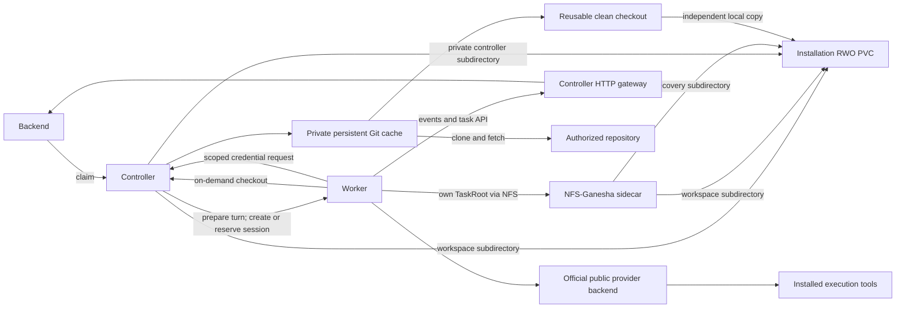
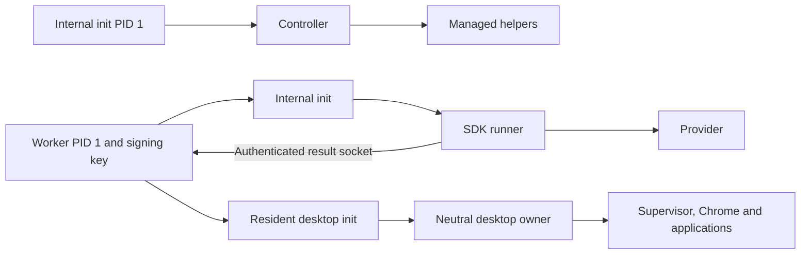

# Multica Runtime Controller

This repository builds the controller base image consumed by [Multica Runtime](https://github.com/korioinc/multica-runtime). Deploy the complete runtime image with the [Helm chart](https://github.com/korioinc/helm/tree/main/charts/multica-runtime-controller).

The controller registers its installed providers with the unchanged Multica backend and claims tasks within its execution capacity. Compatible issue and native agent-DM follow-ups reuse an anchored workspace, provider conversation, and resident worker Pod. Healthy desktop services, browser tabs, and opened applications stay alive between turns. Each turn keeps its own backend task, attempt, credentials, and result. The installed CLI's `__multica_execenv_prepare` helper generates current metadata in controller-private scratch before each official `pkg/agent` execution. Repository checkout remains on demand through `multica repo checkout`. Each worker mounts only its conversation root and runs in that root's `workdir`.


```mermaid
flowchart LR
  Backend -->|claim| Controller
  Controller -->|prepare turn; create or reserve session| Worker
  Controller -->|workspace subdirectory| Storage[Installation RWO PVC]
  Ganesha[NFS-Ganesha sidecar] -->|workspace subdirectory| Storage
  Worker -->|own TaskRoot via NFS| Ganesha
  Worker --> Adapter[Official public provider backend]
  Adapter --> Tools[Installed execution tools]
  Worker -->|events and task API| Gateway[Controller HTTP gateway]
  Gateway --> Backend
  Controller -->|private controller subdirectory| Storage
  Ganesha -->|nfs-recovery subdirectory| Storage
  Worker -->|on-demand checkout| Controller
  Controller --> Cache[Private persistent Git cache]
  Cache -->|clone and fetch| Git[Authorized repository]
  Cache --> Baseline[Reusable clean checkout]
  Baseline -->|independent local copy| Storage
  Worker -->|scoped credential request| Controller
```

The [lifecycle reliability analysis](docs/runtime-lifecycle-reliability.md) records the six reported symptoms, operating evidence, and recovery boundaries.

## Storage and scheduling

The Helm installation owns one RWO PVC, configured through `controller.storage`. Its `controller/`, `nfs-recovery/` and `workspace/` directories hold private journal data, NFS recovery data and task files. Container mounts select these directories with `subPath`; only the initializer mounts the PVC root. The controller and its NFS-Ganesha sidecar mount `workspace/` directly in the same Pod. Ganesha exports `/workspace`; each worker's inline NFS source and container mount use the same canonical TaskRoot, `/workspace/<workspace-folder>/<task-folder>`. New paths follow the pinned CLI naming rule: the workspace slug (such as `kor-io`) and issue identifier (such as `kor-219`) each become a sanitized lowercase prefix followed by the corresponding UUID's last 12 characters. Empty prefixes fall back to `workspace` and `task`, respectively. Each segment is at most 24 ASCII characters. The private journal binds full UUIDs and refuses path collisions. Workers receive no mount of the workspace root, sibling tasks or controller state. Creating and completing attempts creates no task PVCs.

Run one controller replica with the Recreate strategy. Its private journal holds an exclusive process lock, task ownership, resource UIDs, preparation records, resume bindings and terminal delivery state. The controller keeps an isolated in-memory copy of the last durable journal publication. Reads copy that committed state; transactions validate and fsync changes before publishing them, and unchanged transactions skip rewriting. Startup still verifies the complete file, publication failures block further use, and unexpected file identity or metadata changes require recovery rather than silently replacing authority. Ganesha receives its recovery directory separately from the workspace export. The export excludes the journal and controller credentials. Task-count and byte budgets reject new admission without deleting existing data.

All request types use one Pod lifecycle and the same default ten-minute idle retention. A context uses the full installation, workspace, issue or native chat UUID, and agent tuple. Other requests remain scoped to their real task ID. New Pods use the `worker-` prefix; context kinds only distinguish identities. Safe reuse requires matching context, observed authority, repository scope, image, configuration, and settled task execution. A replacement additionally needs final writer proof. Missing native hints, unresolved defaults, or opaque integrations permit fresh provider history in the same safe workspace. Native resume requires exact accepted producer evidence and compatible native settings. Changed authority or scope requires a fresh workspace and Pod. Cross-task channel reuse remains disabled because the backend exposes no reset revision.

The first real task anchors the native root, `.task_owner`, and `.task_roots` index. Task context, API calls, events, and results retain each task's actual ID. Frozen paths survive display-name changes. Codex sessions remain in the root's `codex-home`; Pi sessions remain in `pi-sessions`. A provider process starts once per turn, using fresh history unless native resume is separately validated. Task processes and private credentials end at settlement. Conversation-owned desktop applications can continue loading pages, downloading files, and writing documents during idle.

Every protocol-2 turn generates configuration outside the exported workspace. Only immutable skill generations are exported under `.multica-runtime-artifacts`. Private assignment input binds their manifest and carries configuration and optional resources. The worker hashes the exact copied bytes before selecting its private metadata view. Fixed native projections are established before applications start; warm preparation does not rewrite user instruction files or native history. A required unowned collision refuses preparation. Optional resource collisions preserve user files and omit the runtime resource view. A non-credential task guard remains valid through idle.

Claude tasks use the same signed WorkerSession assignment and result protocol. Transcripts remain in the task root's `claude-sessions/workdir`; settings and credentials remain in private HOME. The preparation helper's disabled-skill policy reaches Claude through the managed `--settings` file. Claude uses the same Pod and workspace policy as Codex and Pi. Its unproven effective native model and effort prevent automatic native history resume, without disabling safe Pod retention or workspace reuse.

`runtime.conversationIdleTimeout` defaults to `10m` and becomes `MULTICA_CONVERSATION_IDLE_TIMEOUT`. Zero disables Pod retention while preserving validated workspace continuity. `runtime.maxResidentPods` becomes `MULTICA_MAX_RESIDENT_PODS`; zero resolves to execution capacity. Safe idle Pods do not occupy execution capacity. Create intents and live, terminating, or uncertain Pods occupy resident capacity. An oldest-idle eviction must prove termination before a replacement starts. Reservation and expiry compete atomically; equality with the recorded deadline means expired. Active turns use their own execution deadline.

Pod deletion, node unavailability, lease expiry and an access mode are not proof that a writer stopped. Unproven writers remain quarantined and occupy capacity. Positively stopped execution releases capacity independently of backend availability. A live protocol-2 session retains dirty storage and its exact writer lease; only that authorized owner can reserve another compatible turn. A replacement requires clean final proof, actual termination, and an accepted latest producer. Missing final flush proof leaves the storage dirty after capacity release. The installation PVC and task files remain after Pod cleanup, with no task-data GC.

Journal format 16 is the single version marker for controller-owned persistent state. Valid formats 6–15 migrate after their original contracts validate. Historical bootstrap bytes, signatures, resource identities, uncertain deliveries, and quarantine obligations remain intact. Nonclosed protocol-1 sessions durably enter draining before service resumes. Existing results, events, and stop traffic can finish; no new protocol-1 assignment is issued. Unreserved claims pinned to an older image fail admission instead of receiving an unsupported new bootstrap. Older controller binaries reject format 16. Rollback requires a separate proven offline transformation after protocol-2 sessions close.

Normal completion publishes the actual SDK outcome with a separate signed `ResultReceipt`. The worker closes task routes, stops task processes, and clears task-private state while resident applications remain active. A signed `TurnExecutionReceipt` certifies those three outcomes under fresh session authority. Exact backend acceptance and settled events permit idle retention; they publish no clean checkpoint and retain the writer lease. Cleanup failure never replaces an authenticated completed outcome. Final shutdown stops both process trees, joins their waits, coordinates controller writers, and flushes storage. A clean session receipt, actual Pod termination, and exact latest-producer evidence permit the first new clean checkpoint.

The `controller.storage.maxBytes` admission budget counts workspace files. Leave space for journal and NFS recovery data in the same PVC. PVC capacity and admission accounting are not filesystem hard quotas. NFS filehandles, lock recovery, flushing, and node-only network access require local validation on the selected filesystem and CNI.

The chart configures the pinned Ganesha 9.5 image for NFSv4.0 with delegations disabled. This avoids its directory-delegation protocol error on newer Linux clients; task execution deduplication remains journal-controlled. Filehandle and lock recovery must be verified on that exact protocol baseline.

## Task authority and completion

The worker uses the internal controller gateway over HTTP on port 8080, restricted by the installation NetworkPolicy. The Multica backend accepts HTTP or HTTPS origins, including Kubernetes Service URLs such as `http://multica-backend:8080`. The [business API proxy](src/internal/daemonapi/proxy.go) forwards normal `/api` requests by default, including new business endpoints without an allowlist update. Endpoint permissions, query filters, body fields and object access belong to the backend. The controller does not restrict attachments to the current or task-created issue, rebuild multipart uploads, rewrite attachment URLs, or interpret business response bodies.

The [endpoint policy](src/internal/daemonapi/policy.go) rejects the following operations locally after normalized-path validation and before reading the body, checking admission or contacting the backend. Namespace exclusions include their roots and descendants; endpoint rules match exact methods and segment counts, with `HEAD` treated as `GET` for protected reads.

| Protected operation | Blocked routes |
| --- | --- |
| Workspace lifecycle | `POST /api/workspaces`, `DELETE /api/workspaces/{id}` |
| Personal credentials and authentication | `/api/tokens`, `/api/cli-token`, `/api/auth`, `/auth`, including descendants and every method |
| Personal account connections | Composio connect-init `POST`, OAuth callback `GET`/`HEAD`, connection deletion `DELETE`; Lark, Slack, DingTalk, WeCom and Telegram `POST /api/{channel}/binding/redeem` |
| Daemon protocol | `/api/daemon` and its descendants, every method, for provider requests only |
| Runtime control | Runtime deletion and both delete aliases; `POST` runtime update, model discovery, local-skill discovery and local-skill import |
| Runtime profiles | Profile creation `POST` and profile detail `PUT`/`PATCH`/`DELETE`, which change daemon execution configuration or tear down runtimes |
| Cloud machine control | Node creation `POST`, deletion `DELETE`, and `POST` start, stop, reboot or exec |
| Legacy onboarding bootstrap | `POST /api/me/onboarding/runtime-bootstrap` and `/no-runtime-bootstrap`, until the backend binds their body workspace to the task workspace |

Blocked requests receive HTTP 403 JSON with code `runtime_controller_endpoint_blocked`, the message `This endpoint is blocked by multica-runtime-controller and is unavailable.`, the method, path without its query and the policy reason. Some Multica CLI versions show a generic permission message for 403; use `--debug` to inspect the original response. The prepared task instructions include this diagnostic guidance.

Workspace updates, member administration, MCP and plugin APIs, workspace integration setup and installation-scoped plugin tokens otherwise reach the backend. Workspace bodies are forwarded without the former description/context-only restriction. Runtime metadata `PATCH`, runtime/profile reads, existing discovery results and Cloud node status `POST` remain available. Forwarding does not override backend task-actor, role, resource or feature-flag restrictions.

Before forwarding or dispatching an MCP call, the controller retains task capability and Pod admission checks, the original task token and the admitted workspace. Caller identity headers and cookies cannot replace the admitted identity; the backend derives the actor from the original task token. Raw queries, request bodies, idempotency keys, conditional and range requests, client metadata, content encoding, pagination headers and backend errors are preserved. Requests are buffered before forwarding and responses are streamed, each bounded to 128 MiB to accommodate the backend's 100 MiB file limit. Redirects are rejected. Revoked attempts cannot begin a new response, including after an informational response.

`/api/task-mcp` and its descendants retain their separate approved-tool and credential broker instead of reaching the default proxy. Other non-API paths are not backend forwarding routes; account authentication is explicitly routed to the local denial filter. The header filter is unchanged, so allowing a route alone does not enable browser-session plugin bridge calls that need the installation header. GitHub authentication, repository checkout, controller daemon operations, start permission, result signatures and task storage cleanup retain their existing execution authority. Start permission is durably consumed once.

Quick Create passes its selected project, parent, priority and due date through the task prompt and native CLI flags. The existing environment supplies the completion origin and uploaded attachment IDs. The controller no longer inserts or validates these fields in issue creation requests. Successful issue creation does not write attachment ownership into the journal; old `createdIssueIDs` fields remain readable and preserved for journal compatibility but are not used for authorization.

These routes use the existing Multica backend and its authorization policy. No backend changes are required for the controller to forward them.

The management gateway and task relay allow up to one minute for a request. For slow skill import or refresh, use the native CLI's `MULTICA_HTTP_TIMEOUT=60s` setting; its default client timeout is 30 seconds.

The worker remains Linux PID 1 and owns result signatures and task storage cleanup. It starts sibling fixed init roles: `runtime init worker desktop <socket>` for the conversation and `runtime init worker run <socket>` for each SDK turn. The desktop owner uses a separate neutral HOME seeded only with public Chrome content. Kernel ancestry, start identities, and pidfds bind resident membership; an X11 window alone grants no retention. Each direct init child has one `cmd.Wait` owner. Final namespace reaping waits for both barriers. Turn cleanup reaps only exact unmanaged child PIDs and preserves the resident tree.

The runner establishes a private Unix connection after disabling process dumps. PID 1 checks the kernel-reported peer identity against the child of the live init process it started before sending execution input. Init never inherits this result connection. Provider environment variables travel in the authenticated input rather than the launcher environment. Bootstrap capabilities are not forwarded in this input; the result signing key remains in the protected PID 1 process. The immutable bootstrap contains only session identity and restricted control authority. Signed assignment exchange supplies fresh task input after the preceding turn is fenced. The socket is closed on exec for provider children, and stdout is used only for logs. Cancellation signals the runner through init; missing results, broken connections and startup failures cannot manufacture completion.

The complete runtime entrypoint starts `runtime init controller` as PID 1. The controller child keeps its existing helper waits and cancellation. Init accepts only the controller, worker-run, and worker-desktop roles. It forwards control signals and preserves its primary child's status. Init does not authenticate results or certify clean storage. Desktop-root or display-generation loss drains the session instead of recreating a display and claiming continuity.


```mermaid
flowchart LR
  CI["Internal init PID 1"] --> C["Controller"] --> H["Managed helpers"]
  W["Worker PID 1 and signing key"] --> I["Internal init"] --> R["SDK runner"] --> P["Provider"]
  W --> D["Resident desktop init"] --> O["Neutral desktop owner"] --> A["Supervisor, Chrome and applications"]
  R -->|"Authenticated result socket"| W
```

This process separation removes the reproduced SDK wait for orphan zombies. It does not change the official SDK's result contract: live descendants or retained stdout can still delay a result inside the SDK. Result delivery starts when that actual SDK result and its preceding transcript have arrived, independently of the remaining Pod cleanup. The controller uses the unmodified provider protocol and SDK.

Secret and worker Pod creation resume from durable intent after transient errors or restart. The journal retains the original Pod request, including its termination finalizer, so retries use the same name and payload even after deployment settings change. A matching existing object supplies its original UID; an acknowledged UID is never replaced. Older pending Pod requests can be reconstructed only from a validated stop-capable bootstrap and an exactly matching recorded fingerprint. Cancellation atomically rejects new creation intent while allowing earlier requests to record their UIDs for cleanup. If a requested Pod is still unresolved when its task stops or times out, reconciliation completes that original request under revoked execution authority and waits for actual termination before releasing capacity. It issues no new lease or capability. Pod absence alone never proves writer termination.

Before task input, HOME initialization, or desktop startup, PID 1 pins its session signing key. Per-turn admission binds that same key to the current input. Stop, input, and same-key execution admission can wait up to 60 seconds per stage for current Pod/image observations and transient connectivity. Cancellation and permanent authorization errors end startup immediately. Preparation and per-turn deadlines still apply; reusable Pods have no per-task `ActiveDeadlineSeconds`. Malformed execution input fails immediately, and the start request is sent once. Startup diagnostics identify the input/admission stage without logging task payloads or credentials.

Attempt capabilities bind audience, expiration, generation, WorkerSession, turn sequence, and the recorded Pod UID. Idle Pods have no business API or checkout authority. The actual controller token, GitHub App signing key, and broad remote integration token remain controller-only. The task's original agent credential retains its original authority. Terminal receipt revokes new task operations and credential access.

Provider messages and usage pass through the common worker event path; the controller records their sequence and maps the final result to the official terminal contract. A confirmed execution start and a pinned supervisor signature over the exact result challenge permit backend delivery while the Pod is still shutting down. Cancellation acknowledgements retain their existing revoked-execution path. Result signatures bind task, attempt, WorkerSession, turn sequence, Pod and PVC identities but do not certify stopped writers or a flushed filesystem. Existing storage seals can also authenticate legacy results; migrated records never gain an inferred result signature. Repeated identical results are idempotent; conflicting bodies are refused. An unknown transport outcome remains uncertain. A later supported history read can settle an exact authenticated completion without rerunning the provider; unrelated terminal success never creates a completion witness.

Cancellation is reconciled during waiting, preparation, Pod initialization, input/admission, and execution, and after controller restart. Its durable stop intent immediately rejects new execution and task API authority while allowing already authorized operations to drain. Init reads the same stop command and exits without starting a task writer. For a bound Pod between init and worker startup, deletion waits for a real worker container so kubelet retains meaningful termination evidence. Once the worker exists, graceful deletion uses its existing shutdown budget with UID and resource-version preconditions; no second grace delay is added. A separate capability admits only stop registration, observation, and signed stop receipts, even when ordinary execution is quarantined. Stop receipts never replace provider results. Preparation or worker failure without a provider result is recorded as a controller failure; a provider result already observed by the supervisor is persisted first. Unproven writers and their data remain quarantined; process exit alone never establishes task success. Operational logs use identifiers and bounded error categories; provider output is redacted before delivery.

New worker Pods carry a termination-evidence finalizer. After bounded cooperative shutdown, the controller requests normal UID-preconditioned deletion, records actual termination, and removes only its own finalizer using a resource-version check. The chart grants the Pod patch permission needed for this. A deleted, unbound Pod can be proven never started because the API refuses subsequent binding; a bound Pod with missing or synthetic container status remains unproven. Finalizers preserve API evidence, not NFS fencing.

A clean cancellation needs a signed writer-stop/flush receipt and actual Pod termination. A never-started worker can reuse a completed preparation only after the controller flushes that unchanged baseline; server-side flush never certifies a root written by a failed NFS client. Dirty or writer-unknown data requires explicit offline recovery and is never automatically marked clean. Init-only failure, stopped preparation, and worker failure still release proven stopped compute while retaining those data restrictions. Resource cleanup and backend result delivery progress independently. Ambiguous callbacks remain under reconciliation: confirmed-start results may replay only against the same running assignment, while an already-final or changed assignment settles them without claiming payload acceptance. Pre-start failures never replay blindly. A terminated worker without a storage seal retains its original result and the bounded window for a late seal. An authenticated provider result remains authoritative even if cleanup fails; missing storage proof keeps the root dirty and unavailable for reuse. Only a result that has neither a result signature nor a storage seal can take the separate non-retryable shutdown-proof failure path. Authentication and recovery-failure selection compete in one journal transaction.

The controller subscribes to the backend's existing `/api/daemon/ws` task-available notifications for its registered runtime set, then claims work through the HTTP API. Initial startup, reconnects and released compute capacity wake the same serialized claim loop. Settling completion, failure or cancellation delivery also wakes claim after its journal update, including when reconciliation discovers that the backend already ended the task. This lets queued work proceed when an earlier capacity wake found the predecessor still running and the backend notification was missed. `runtime.pollInterval` remains the recovery interval for other missed notifications; successful idle polling is silent. HTTP and HTTPS backend origins use WS and WSS respectively, with the same credentials, TLS trust and redirect blocking.

Preparation completion, worker Pod changes and cleanup wake a bounded attempt queue. Successful partial claim batches also wake the next claim pass to fill independent task capacity, including multiple tasks of one agent. Preparation and admission are re-read after asynchronous operations so legitimate concurrent progress cannot be misclassified as failure. Authenticated results and closed attempts use a separate delivery queue with workers bounded by configured task capacity. Active result delivery does not take the attempt lock used by checkout and Pod shutdown, so cleanup cannot delay the reply. The queue serializes delivery per attempt; session resource cleanup has its own queue and lock. A completed attempt never deletes its shared Pod or Secret. A valid v2 task execution receipt can release execution capacity before result delivery settles. Resident ownership and the exact dirty writer lease remain through compatible turns until proven Pod termination. Duplicate hints are coalesced, including hints received while an attempt is being processed. The journal and fresh Kubernetes admission remain authoritative; watched Pods only trigger observations. A periodic sweep of pending journal records continues preparation leases, cancellation and stop deadlines when no events arrive. Stop capabilities remain valid through the full worker termination budget; task API capabilities keep their narrower expiry.

Modern turns use the existing daemon status endpoint after the backend revokes the task token. Signed cancellation acknowledgements also use daemon authority. Confirmed terminal states settle ordinary failure delivery without replacing its recorded result or claiming that its payload was accepted. Status cannot authorize execution or publish a continuity checkpoint. Assignment and generation checks still control execution authority.

Signed result delivery can use a controller-authorized task read when the task token expires. The configured controller credential must already have ordinary task-read permission, such as an authorized PAT or user JWT. Daemon-only `mdt_` credentials do not provide this permission; inaccessible observations cannot authorize delivery. This read must match the original assignment, and checkpoint publication still requires the exact accepted result. Execution admission, business requests, and continuity selection retain their task-token checks.

Skill bundles are acquired in bounded batches while MCP preparation runs independently under the same preparation deadline. Required MCP failures cancel and join outstanding discovery. Protocol-2 preparation runs the helper in private scratch, validates immutable skills, and refreshes fixed native projections. Private provider configuration stays outside the exported workspace. Runtime guidance is prepended to the current prompt; mixed user instruction files remain intact. Reuse validation, helper writer termination and the worker's NFS tree validation remain separate checks.

## Image and configuration

The base contains `/opt/multica/controller/runtime`, its build metadata, the internal init implementation, and Go 1.27.1. The complete runtime supplies `/opt/multica/runtime/image.json`, which declares immutable paths, hashes, versions, platform and environment defaults. It installs public HOME defaults directly into `/home/multica/agents` at image build time. Descriptors with the retired `homeSeed` field are rejected; rebuild the complete runtime with the matching controller base. The preparation CLI version is selected by the runtime image and reported in API requests and registration, without a release allowlist. The helper protocol marker identifies the adapter contract rather than an allowed CLI release; incompatible behavior fails during preparation or execution. The public provider package remains pinned to `v0.0.0-20260911104201-2ae2dbbb8f9e`. Execution inventory IDs are opaque strings.

Controller build metadata, runtime descriptors, image references, Pod receipts, configuration bundles, and prepared records use the paired runtime implementation and validated content. The session bootstrap and signed control messages also carry an explicit protocol version. Rebuild the controller base and complete runtime together when changing these formats. Existing journals containing the previous controller contract are not converted automatically. Preserve their data and use a separate installation with fresh storage or a separately validated offline migration; editing individual metadata keys does not update the stored execution bindings.

```sh
/opt/multica/controller/runtime version
/opt/multica/controller/runtime image verify
```

Image and mount admission applies to the controller and every worker. Their main containers keep writable, unmounted `HOME=/home/multica/agents` and use its image-provided files directly. Startup writes only captured operator configuration; it does not copy or synchronize a HOME seed. Container replacement starts from the image HOME while task work and provider sessions remain on workspace storage. Each retained-Pod turn restores managed HOME files from the captured baseline, then applies its current configuration and rotates private credentials. Worker init creates only private temporary/control directories. Operator files come from `operator.configVolumes` and `operator.configMounts`; operator environment comes from `operator.env` and `operator.envFrom`. Their captured content is bound into execution identity. The preparation helper may link immediate Codex skill directories from this captured HOME into a task. The controller admits only the matching HOME directory and rejects redirected links on preparation and reuse. Native task-scoped configuration is prepared separately from broad controller credentials.

Resident Chrome uses the existing `/home/multica/agents/.config/google-chrome` profile directory. Task HOME restoration preserves its live state. Resident tasks reject operator configuration files or directories inside that profile, and files that replace its ancestors. The `.config` parent directory remains supported. This prevents task configuration from overwriting a running browser's data.

The complete serialized worker bootstrap must fit one 1 MiB Secret payload, including base64-encoded configuration files, environment, image metadata and attempt capabilities. Separate configuration source groups share this transport budget. The controller rejects oversized common inputs before registering or claiming tasks; each full attempt is checked again during provisioning.

Workers run as UID/GID 65532 with dropped capabilities, no privilege escalation, no host namespaces or mounts, and no Kubernetes service-account token. Their writable container layer holds HOME; temporary/control files use private emptyDir storage. `/dev/shm` has a separate 512Mi memory-backed emptyDir; consumption also counts against worker memory limits. Size CPU, memory and ephemeral-storage for the provider, execution tools, desktop and HOME caches together.

The worker container retains the complete runtime's required Unconfined seccomp policy; init and controller use RuntimeDefault. Kubernetes Pod Security Baseline/Restricted reject explicit Unconfined. Nodes must support the browser's unprivileged user namespaces and its own sandbox; a manifest check does not prove browser functionality.

## Repository checkout and GitHub authentication

Chat and other tasks start without cloning repositories or checking GitHub access. On an explicit `multica repo checkout`, the controller validates task, Pod, workdir, URL/ref and current repository authority. It keeps a bare object cache at `/var/lib/multica/controller/repositories` on the private PVC, outside the NFS export. Cache identity includes the workspace, repository URL and stable authentication identity, including GitHub installation and immutable repository IDs; task IDs and rotating credentials are excluded. The first request downloads the repository and subsequent requests fetch changes. Concurrent requests share an in-progress refresh. Temporary upstream failures refuse the new checkout while retaining valid cached objects for the next refresh.

The controller keeps a clean, independent checkout beside the bare cache. Its identity covers current branch and tag objects, remote HEAD, the selected commit, and the original URL. Unchanged Git state reuses that checkout; a changed state creates a new clean baseline using only objects reachable from current remote refs. The latest baseline persists, and a superseded baseline remains pinned until its task copies finish. This removes repeated bundle creation, import and HTTP data transfer. Only the controller downloads remote repository data.

On demand, the controller copies the baseline into the task's workdir on its local PVC mount. Each task gets its own Git objects and files without hardlinks or alternates. The worker observes the completed path through NFS before returning it to the CLI. If the path is still cached as missing, an exclusive temporary directory creation/removal inside its workdir refreshes the parent metadata. Existing task checkouts are authorized and validated without fetching, resetting or cleaning local work. Cache eviction cannot break completed task copies. New Git states still require local baseline materialization, and new workspace generations require independent local copies; no filesystem copy-on-write support is assumed.

Repository-internal symbolic links are allowed; links outside the repository, unresolved links, linked Git metadata and shared Git objects are refused. Publication never replaces an existing destination. Filesystems that reject atomic no-replace directory rename use exclusive directory and file creation with a pending marker. Interrupted copies preserve their data and refuse automatic reuse. Before touching task files, the controller records its exact container as a checkout writer in the journal. The worker must close checkout authority and wait for controller writers to drain and flush their local filesystem before flushing its NFS client and signing a clean receipt. A failed controller flush remains a durable obligation that a later fence request can retry. After restart, an unresolved writer requires positive evidence that its recorded controller container stopped. Checkout errors do not prevent unrelated chat.

The controller and worker must be rebuilt and deployed together. The former approval/bundle routes and worker importer are removed; no old wire protocol is served. Existing bare caches and task files stay in place. Startup removes only the former private transfer scratch directory as part of the data migration.

Public HTTPS uses the same cache flow, with actual Git connections pinned to validated public IPs and redirects/proxies disabled. Private and loopback endpoints are rejected without an exception setting. Cache hits still require current task and repository authority; obsolete unreachable objects are never exported merely because they remain cached. The cache does not intercept arbitrary shell `git clone` commands or cache LFS payloads, submodule repositories, or package-manager downloads.

Repository caching needs no separate settings or fixed byte quota. Downloads use bounded internal concurrency and follow request cancellation; a shared fetch ends when its last requester leaves. Actual filesystem space exhaustion can reclaim inactive cache data, while pinned baselines, task data and the journal remain protected. Plan PVC capacity for task files, cached objects, clean baselines and temporary copies together. Existing worker scratch settings remain for its other tools. Old `.repos` data is never automatically adopted or removed.

Set both `GITHUB_APP_ID` and `GITHUB_APP_PRIVATE_KEY` through operator environment inputs to enable managed authentication; store the private key in a Secret. The App must have the required repository permissions (Contents read for fetch, write for push). Current installation tokens are issued only for the task's selected repositories and refreshed before expiry; the private key never reaches a worker.

Git uses a repository-aware credential helper. The runtime's GitHub CLI integration obtains a current scoped token per invocation. Explicit repository selection, a GitHub API repository path, GH_REPO, or the checkout origin determines its scope. Commands spanning installation owners require explicit selection. Tokens exclude organization, administration and secrets permissions. A running CLI command is never replayed merely because its token expires. Without managed App authentication, native Git/GitHub configuration applies.

## Runtime logs

`runtime controller` and `runtime worker serve/run/layout` write INFO, WARN and ERROR records as JSON to stdout. Logs identify startup stages, runtime registration, accepted tasks, preparation, worker Pod binding and terminal delivery. Worker completion logs separately identify observed provider results, checkout shutdown, writer shutdown, filesystem flush, and result/receipt delivery. The runner forwards only selected SDK lifecycle fields, including Codex's observed outcome, cleanup and shutdown timeouts, so SDK result delays can be distinguished from Pod cleanup. SDK command lines, configuration and stderr diagnostics are not forwarded. Failures include bounded reason codes and backend HTTP status when available; credentials, task payloads and backend response bodies are omitted.

Secret/Pod creation failures include bounded reasons, timeout/cancellation indicators and HTTP status when available. Per-task phase logs measure skills/MCP acquisition, native preparation, Secret/Pod creation, worker image and HOME/NFS checks, admission, desktop startup and provider startup. The first text response is timed separately from provider session creation. `worker pod bound` includes elapsed time since the local claim was recorded. The backend's `dispatched` state means the claim was assigned; `running` is requested only through the existing once-only worker start path. Pod Ready and first provider text are separate milestones. The official backend, daemon and UI are not modified by these changes.

Normal idle polling and successful backend heartbeats are silent. Heartbeat failures emit warnings; startup and task lifecycle events remain visible. Health probe requests do not produce access logs.

```sh
kubectl -n multica logs deployment/multica-runtime-controller -c controller --timestamps --follow
```

Logging changes require rebuilding the complete runtime with the updated controller base and deploying that image.

## Development

The Go module is in `src`. Owners are `controller` (preparation/dispatch/reconciliation/outbox delivery), `daemonapi` (official input and API mapping), `worker` (public provider backend/PID 1/filesystem), `workspace` (durable task ownership), `kubernetes` (resource identity), `repocache` (private persistent objects/refresh/clean baselines), and `checkout` (confined local copies and retained work).

```sh
make build
make test
make vet
make verify
```

`make verify` includes shell syntax/ShellCheck, repository and workflow validation, release-authority fixtures, vet and race tests. Go, Make, Bash, jq, Git and ShellCheck are required. The Go toolchain pin is in `build/runtime-versions.env`.

Run destructive Linux process checks against a locally built complete runtime image:

```sh
scripts/test-pid1.sh multica-runtime:desktop-local-arm64
scripts/test-resident-helper.sh multica-runtime:desktop-local-arm64
scripts/test-resident-desktop.sh multica-runtime:desktop-local-arm64
```

The driver uses the pinned Go toolchain and requires an image matching the native local Docker engine. Each selected `TestInit*` or `TestPID1*` runs as non-root PID 1 in a fresh container. Capabilities are removed; private paths use disposable mounts. No Docker init wrapper is used. Skips fail verification. The output records the image identity, test binary hashes, and logs. An optional second argument selects a Go test-name pattern.

Browser fixtures keep the image HOME visible in the container's writable layer, matching production. They verify the original profile directory and unchanged browser state across turns.

The helper driver exercises installed providers and private metadata without external model credentials. The graphical driver uses separate local controller and worker containers on an internal network. A local Responses API fixture drives two actual Codex assignments. Chrome uses Open Browser Use; Mousepad uses native Cua. The procedure records process identities, retained tab and unsaved buffer state, idle activity, native resume, task cleanup, and final storage publication after actual worker termination.

Full architecture acceptance additionally requires the pinned CLI's preparation/reuse contract, installed Codex/Pi startup and session behavior, actual Linux PID 1 sealing/flush tests, NFS restart tests, and at least two disposable local Kubernetes nodes with a policy-enforcing CNI. The chart's [local verification instructions](https://github.com/korioinc/helm/tree/main/charts/multica-runtime-controller/tests) own that procedure. Unit tests and Helm rendering do not establish NFS recovery, cross-node durability or network enforcement.

The [PR workflow](.github/workflows/create-develop-to-main-pr.yml) runs source checks on PRs into `develop` and `main`, and maintains the develop-to-main promotion PR. The [image workflow](.github/workflows/develop-image.yml) builds and verifies both native Linux platforms when `develop` changes, then publishes only `ghcr.io/<repository-owner>/multica-runtime-controller:develop`. It can also be dispatched manually on that branch. It does not create per-build tags, GitHub Releases, or update `latest` or [`VERSION`](VERSION).

Main keeps the required checks `verify` and `runtime-image`. The latter is the image workflow's final verification result for that exact commit, not another PR image build. It fails when source verification or either native image build fails, is cancelled, or is skipped; registry publication is a separate step after image verification. A same-repository `develop` PR emits only an informational `develop-image-reused` check and relies on its head commit's develop build. A new PR head needs its own successful result. Other PRs into `main`, including fork branches named `develop`, receive separate amd64 and arm64 image checks with read-only repository access and no registry publication. PRs into `develop` run source checks; image verification follows after merging into develop.

Develop runs are serialized through publication, with only the newest pending run retained. Publication rechecks the current branch HEAD and the run number recorded on the existing image index, so a superseded branch revision or an older run retried at the same commit cannot replace a newer published build. Platform images are staged by digest without tags; only the verified pair receives the `develop` tag. Failed or superseded builds leave the existing tag in place. Registry manifests without tags may remain; the workflow does not delete manifests that an image index may still reference.

This workflow publishes the controller **base** image. Consuming it in a complete runtime build and rolling out that runtime are separate deployment steps. Existing workers remain bound to their controller's admitted complete-image digest.

To release, explicitly increase VERSION (for example, `1.2.3`) and merge it into `main`. The [tag workflow](.github/workflows/tag-version.yml) creates the matching tag (`1.2.3`, without a `v` prefix) at that exact commit and requests the [release workflow](.github/workflows/release.yml). A main push with an unchanged VERSION does not request a release.

The release workflow runs only through a dispatch on `main`, with an existing tag and its original full commit SHA supplied as inputs. Tag pushes do not start this workflow. The workflow and release control scripts are pinned to the main commit selected for that run; the tagged source is checked out separately after its tag and main ancestry are verified. Jobs with write permissions execute the control scripts from main, including the native image verifier. The source test job has read-only repository permissions.

For a manual retry, run `gh workflow run release.yml --ref main -f tag=1.2.3 -f expected_revision=<full-commit-sha>`. The tag must match the committed VERSION and identify a commit in main's history. The workflow validates the source, builds and verifies both native Linux platforms, then publishes the controller base to GHCR and creates a GitHub Release. Retries retain the verified image bytes; completing an older release never moves the GHCR or GitHub latest pointer backwards.

The automatic tagger uses the job's `GITHUB_TOKEN`. Repository writers remain trusted to manage workflows and create tags; these workflow checks do not enforce a separate release identity.
